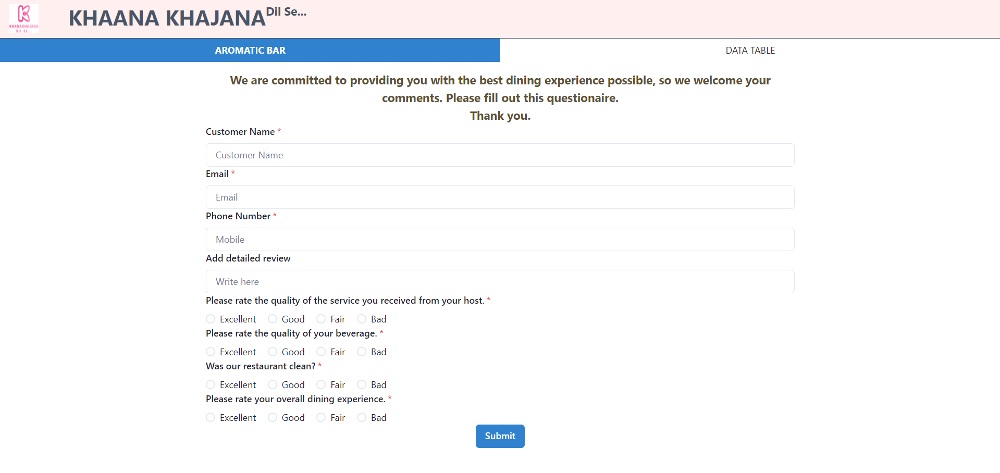
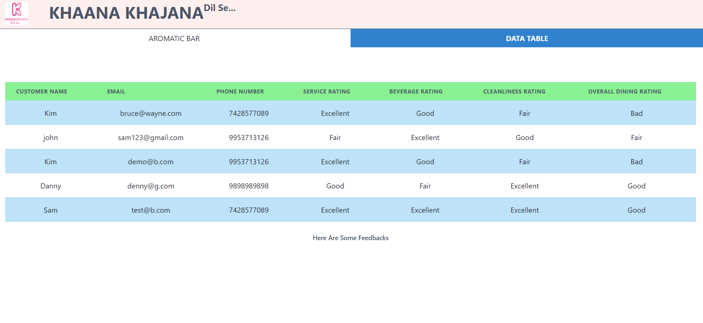

# Project Title

## Introduction

 This React application provides a user-friendly feedback and grievance system for the Retaurant [Khaana Khajana App]. Users can submit feedback on their dining experience and view past submissions for reference

## Project Type

 Frontend (React)

## Deplolyed App

 Frontend: https://react-f-g-sarika.vercel.app/

## Video Walkthrough of the project

 <video width="100%" height="60%" controls>
   <source src="videodemo.mp4" type="video/mp4">
</video>

## Features

- Feedback Form: Users can provide feedback by entering their name, email, phone, and ratings for service, beverage, cleanliness, and overall experience.
- Feedback List: Submitted feedback is displayed in a clear table format, allowing users to review past entries.
- Local Storage: Data is stored locally in the user's browser for easy access without requiring additional server infrastructure.

## Design Decisions or Assumptions

- Chakra-UI is used for a clean and modern design.
- Feedback is stored in local storage for simplicity, but you can consider implementing a backend for more advanced features and persistence across devices.

## Installation & Getting started

1. Clone this repository
    ```
    git clone https://github.com/sarikasingh30/React_F-G_Sarika.git
    ```

2. Install dependencies:

    ```
    cd React_F-G_Sarika
    npm install
    ```
3. Run the development server:
    ```
    npm start
    ```

This will start the application in development mode at http://localhost:3000/.

## Usage

1. Submit Feedback (Tab 1):

Fill out the feedback form with your details and ratings.
Click the Submit button.
Upon successful submission, a confirmation message is displayed, and the data is stored in local storage.



2. View Feedback (Tab 2):

Submitted feedback entries are displayed in a table format.
Clicking on a table row opens a detail view with all submitted information.



## Technology Stack

List and provide a brief overview of the technologies used in the project.
- Reactjs
- HTML
- CSS
- JavaScript
- Chakra UI (for UI components)
- Local Storage (for data persistence)
